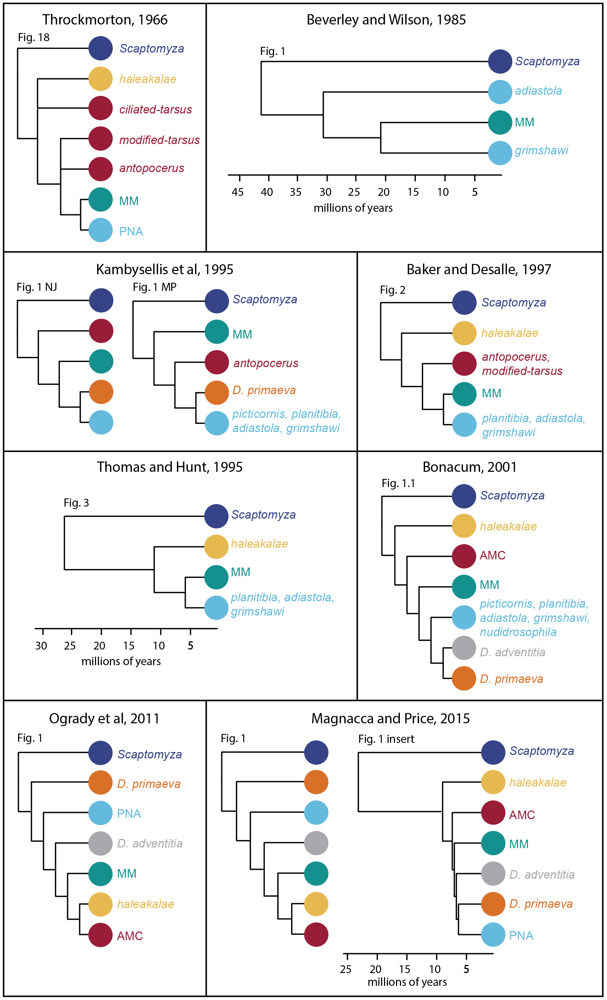
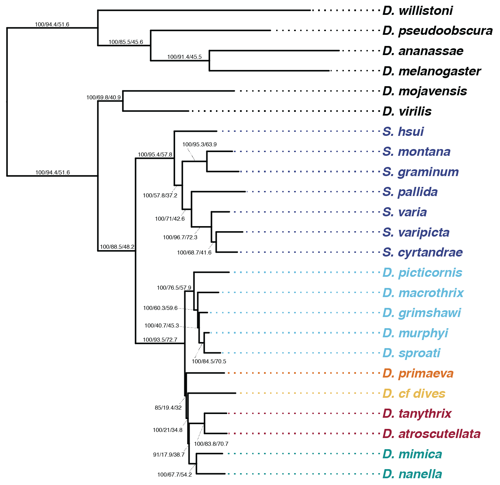
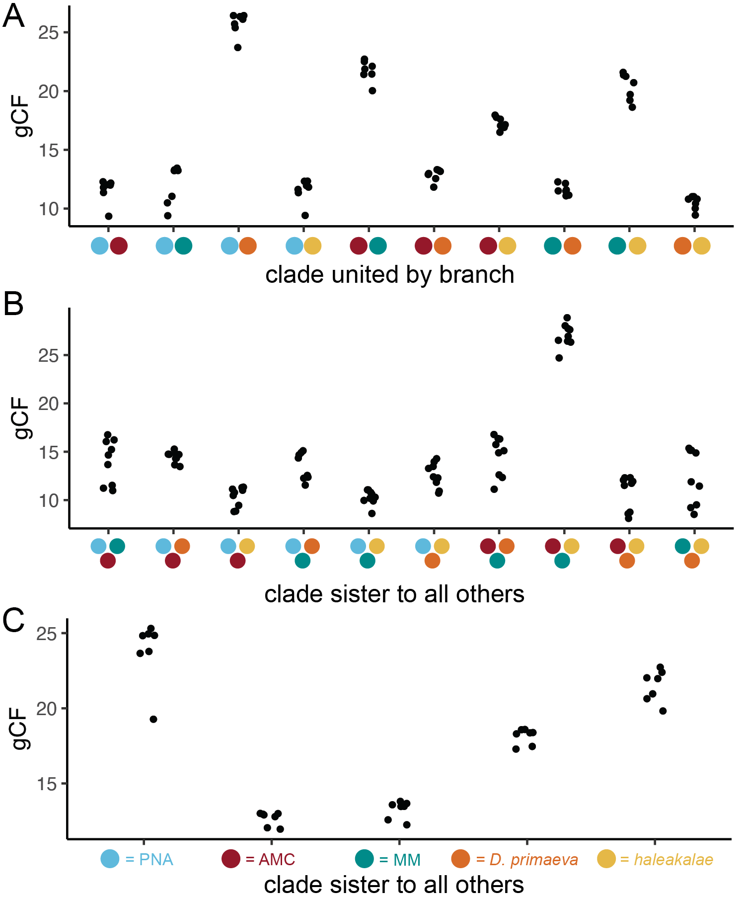
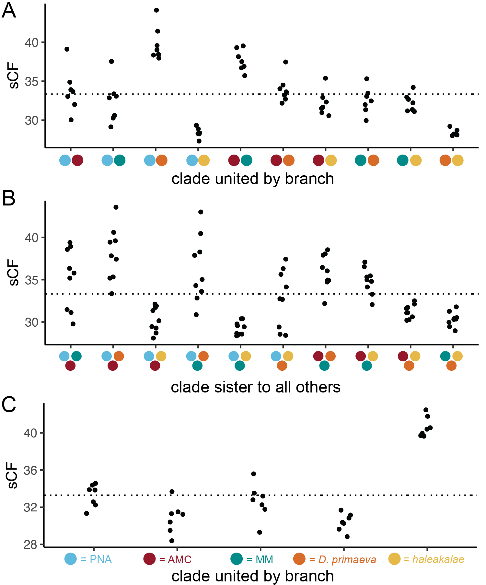
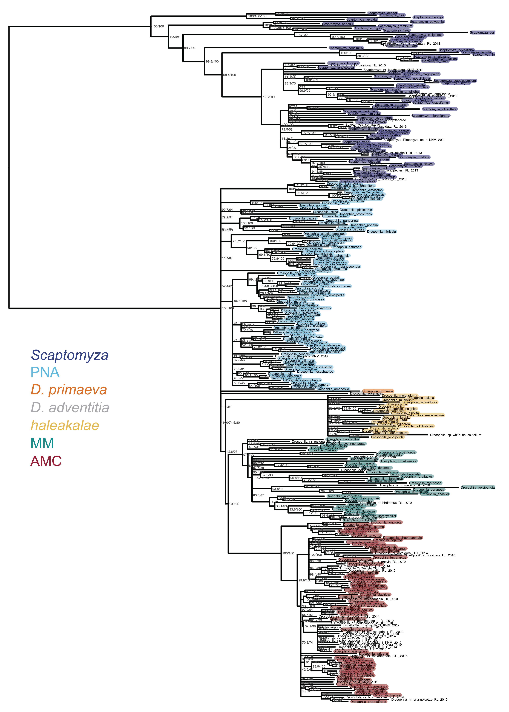
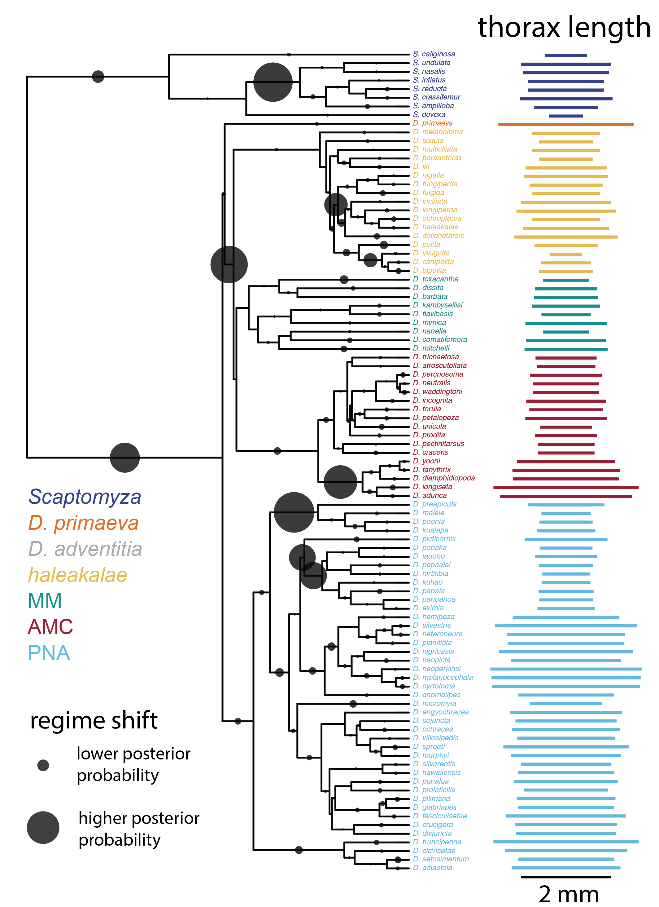
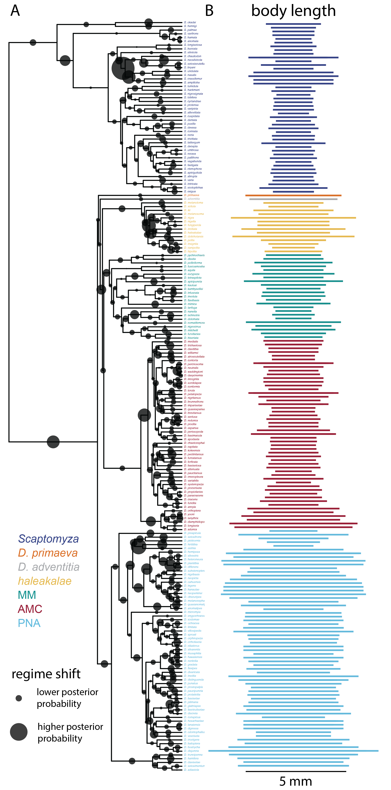
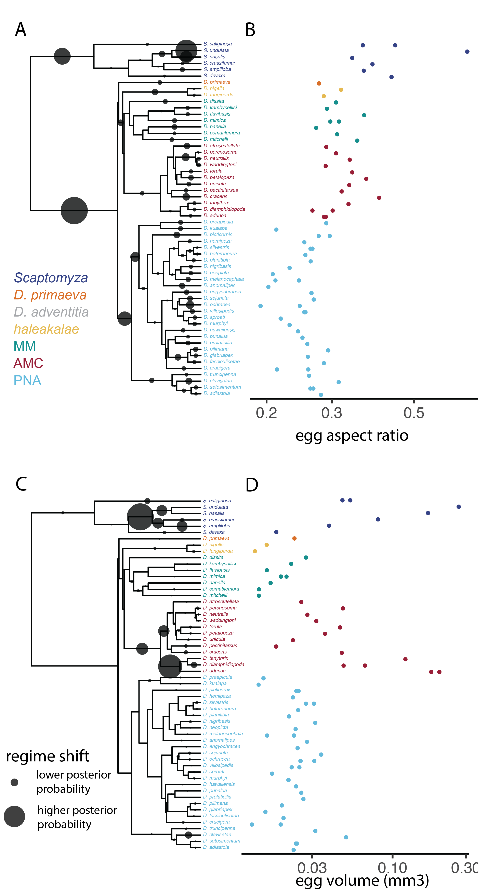
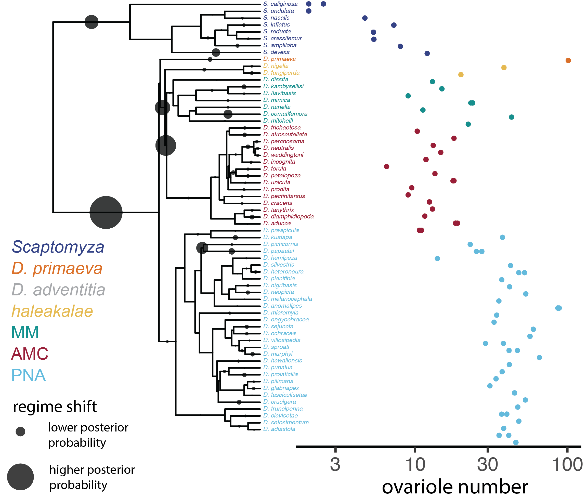

\makeatletter
\renewcommand{\thefigure}{S\@arabic\c@figure}
\renewcommand{\thetable}{S\@arabic\c@table}
\makeatother

```{r global options,include=FALSE}
knitr::opts_chunk$set(echo=FALSE,include=FALSE,warning=FALSE,message=FALSE,results=FALSE,cache=TRUE)

library(dplyr)
library(ape)
library(ggtree)
library(treeio)
library(ggplot2)
library(seqinr)
library(phytools)
library(bayou)
library(surface)
library(viridis)
library(gridExtra)
select <- dplyr::select
theme_set(theme_classic())
options(tinytex.clean=FALSE) # keeps aux file for main manuscript
set.seed(84095)
```
\vspace{12pt}
^1^ Department of Organismic and Evolutionary Biology, Harvard University, Cambridge, MA 02138, USA

^2^ Department of Molecular and Cellular Biology, Harvard University, Cambridge, MA 02138, USA

\* Corresponding author


## Previous phylogenetic hypotheses {-}

(ref:previous-phylo) published[@throckmorton1966relationships;@beverley1985ancient;@kambysellis1995pattern;@thomas1991molecular;@baker1997multiple;@Bonacum2001;@o2011phylogenetic;@magnacca2015rapid]

```{r previous-phylogenetic-hypotheses,include=T,results=T,warning=F,out.height="90%",fig.cap="Selected previously published phylogenetic hypotheses for the relationships between clades of Hawaiian Drosophilidae. Figure labels indicate the figure number as originally (ref:previous-phylo).",fig.align="center"}

```

## Phylotranscriptomic results {-}

```{r clades-groups-setup}

source("analysis/comparative_analysis/species.R")

unplaced_taxa <- new_sp %>% filter(clade == "Unplaced Hawaiian Drosophila species")
placed_sp <- new_sp %>% filter(!name %in% unplaced_taxa$name)

clades <- c("Scaptomya","D. primaeva","D. adventitia","PNA","AMC","MM","haleakalae")

clade_group <- data.frame(group=c("antopocerus","modified tarsus","adiastola","planitibia","nudidrosophila","grimshawi","haleakalae","modified mouthpart","picticornis","primaeva","rustica","Unplaced modified mouthpart group species"),clade=c("AMC","AMC","PNA","PNA","PNA","PNA","haleakalae","MM","PNA","D. primaeva","rustica","MM"))

placed_sp <- placed_sp %>% select(-clade) %>% left_join(.,clade_group,by="group") %>% mutate(clade=ifelse(genus == "Scaptomyza","Scaptomyza",clade)) %>% mutate(clade=ifelse(species == "adventitia","D. adventitia",clade))

clade_taxa <- placed_sp %>% arrange(clade,name) %>% group_by(clade) %>% group_split() %>% lapply(.,function(x){x %>% pull(name)})
names(clade_taxa) <- placed_sp %>% arrange(clade,name) %>% pull(clade) %>% unique()

group_taxa <- placed_sp %>% arrange(group,name) %>% group_by(group) %>% group_split() %>% lapply(.,function(x){x %>% pull(name)})
names(group_taxa) <- placed_sp %>% arrange(group,name) %>% pull(group) %>% unique()

subgroup_taxa <- placed_sp %>% arrange(subgroup,name) %>% group_by(subgroup) %>% group_split() %>% lapply(.,function(x){x %>% pull(name)})
names(subgroup_taxa) <- placed_sp %>% arrange(subgroup,name) %>% pull(subgroup) %>% unique()

subgenus_taxa <- placed_sp %>% arrange(subgenus,name) %>% group_by(subgenus) %>% group_split() %>% lapply(.,function(x){x %>% pull(name)})
names(subgenus_taxa) <- placed_sp %>% arrange(subgenus,name) %>% pull(subgenus) %>% unique()

color_scheme <- c("#991B37","dark gray","#D86F27","#E5BA52","#068E8C","#65BADA","#D3D3D3","#364285","black")
names(color_scheme) <- c(names(clade_taxa),"outgroup")

# table with information on transcriptome sampled species and their clades
transcriptomic_taxa <- read.delim("analysis/data/phylotranscriptomic_taxa.tsv",sep="\t",header=T,stringsAsFactors=F)
``` 

```{r iqtree-main-tree}#,include=T,fig.width=5,fig.height=5,fig.cap="Most likely topology estimated using IQtree. Node labels show boostrap values. Colors correspond to clades described in Fig. 1"}

iqtree_tree <- read.tree("analysis/phylotranscriptomics/iqtree_59/June2021_iqtree59_concord.cf.tree") 
iqtree_tree$tip.label <- plyr::mapvalues(iqtree_tree$tip.label,transcriptomic_taxa$name,transcriptomic_taxa$name_clean)

root_iqtree_tree <- phangorn::midpoint(iqtree_tree,node.labels="support")

plot_height <- 1.5 * max(node.depth.edgelength(iqtree_tree))
iqp <- ggtree(root_iqtree_tree,right=T) + geom_text2(size=1.75,hjust=-0.1,aes(subset=!isTip,label=label))
iqp <- iqp %<+% (transcriptomic_taxa %>% select(name_clean,clade)) + 
  geom_tiplab(align=T,aes(color=clade),size=3,fontface='bold.italic') + # size of label border
  scale_color_manual(values=color_scheme) + 
  theme(legend.position="none")  + xlim_tree(1.5 * max(node.depth.edgelength(iqtree_tree)))
pdf("figure_panels/print-iqtree.pdf",height=5,width=6,useDingbats=F)
print(iqp)
dev.off()
```

```{r raxml-tree,include=T,fig.width=5,fig.height=5,fig.cap="Most likely tree estimated using RAxML. Node labels show bootstrap values. Colors correspond to clades described in Fig. 1 and S1."}

raxml_tree <- read.tree("analysis/phylotranscriptomics/speciestree-166/RAxML_bipartitions.alignment.fa") 
raxml_tree$tip.label <- plyr::mapvalues(raxml_tree$tip.label,transcriptomic_taxa$name,transcriptomic_taxa$name_clean)

rxp <- ggtree(raxml_tree,right=T) + geom_text2(size=2,hjust=-0.1,aes(subset=!isTip,label=label))
rxp <- rxp %<+% (transcriptomic_taxa %>% select(name_clean,clade)) + 
  geom_tiplab(align=T,aes(color=clade),size=3,fontface='bold.italic') + # size of label border
  scale_color_manual(values=color_scheme) + 
  theme(legend.position="none")  + xlim_tree(1.5 * max(node.depth.edgelength(raxml_tree)))
rxp
```

```{r phylobayes-tree,include=T,fig.width=5,fig.height=5,fig.cap="Consensus tree estimated using PhyloBayes. Node labels show posterior support. Colors correspond to clades described in Fig. 1 and S1."}
  
phylobayes_tree <- read.tree("analysis/phylotranscriptomics/phylobayes_59/bpcomp.con.tre")  
phylobayes_tree$tip.label <- plyr::mapvalues(phylobayes_tree$tip.label,transcriptomic_taxa$name,transcriptomic_taxa$name_clean)

root_phylobayes_tree <- phangorn::midpoint(phylobayes_tree,node.labels="support")

pbp <- ggtree(root_phylobayes_tree,right=T) + geom_text2(size=2,hjust=-0.1,aes(subset=!isTip,label=label))
pbp <- pbp %<+% (transcriptomic_taxa %>% select(name_clean,clade)) + 
  geom_tiplab(align=T,aes(color=clade),size=3,fontface='bold.italic') + # size of label border
  scale_color_manual(values=color_scheme) + 
  theme(legend.position="none")  + xlim_tree(1.5 * max(node.depth.edgelength(root_phylobayes_tree)))
pbp
```

```{r astral-tree,include=T,fig.width=5,fig.height=5,fig.cap="Coalescent tree estimated using ASTRAL. Node labels show local posterior probabilities. ASTRAL estimates branch lengths for internal nodes only, therefore tip branch lengths have been artificially set to a length of 0.5 coalescent units. Colors correspond to clades described in Fig. 1 and S1."}

reroot_tree_with_support <- function(tree,out){
  root_tree <- ape::root(tree,out,edgelabel=T,resolve.root=T)
  root_mrca <- getMRCA(root_tree,out)
  root_node <- root_tree$edge[which(root_tree$edge[,2]==root_mrca),][1]
  root_edges <- which(root_tree$edge[,1]==root_node)
  root_length <- root_tree$edge.length[root_edges[1]] + root_tree$edge.length[root_edges[2]]
  root_support <- root_tree$node.label[which(root_tree$edge[,2]==1)]

  root_tree$edge.length[root_edges[1]] <- root_length
  root_tree$edge.length[root_edges[2]] <- root_length
  root_tree$node.label[which(root_tree$node.label == "")] <- root_support
  root_tree$node.label[which(root_tree$node.label == "Root")] <- ""
 
  return(root_tree)
}

outgroup <- c("D. willistoni","D. melanogaster","D. pseudoobscura","D. ananassae")

astral_tree <- read.tree("analysis/phylotranscriptomics/astral_59/astral_June2021_iqtree59_loci.tree") 
astral_tree$edge.length[is.na(astral_tree$edge.length)] <- 0.5
astral_tree$tip.label <- plyr::mapvalues(astral_tree$tip.label,transcriptomic_taxa$name,transcriptomic_taxa$name_clean)

root_astral_tree <- reroot_tree_with_support(astral_tree,outgroup)

asp <- ggtree(root_astral_tree,right=T) + geom_text2(size=2,hjust=-0.1,aes(subset=!isTip,label=label))
asp <- asp %<+% (transcriptomic_taxa %>% select(name_clean,clade)) + 
  geom_tiplab(align=T,aes(color=clade),size=3,fontface='bold.italic') + # size of label border
  scale_color_manual(values=color_scheme) + 
  theme(legend.position="none")  + xlim_tree(1.5 * max(node.depth.edgelength(root_astral_tree)))
asp
```

```{r iqtree-occupancy-tree}

iqtree_80_tree <- read.tree("analysis/phylotranscriptomics/iqtree_60/June2021_iqtree60_concord.cf.tree") 
iqtree_80_tree$tip.label <- plyr::mapvalues(iqtree_80_tree$tip.label,transcriptomic_taxa$name,transcriptomic_taxa$name_clean)

root_iqtree_80_tree <- reroot_tree_with_support(iqtree_80_tree,outgroup)

plot_height <- 1.75 * max(node.depth.edgelength(iqtree_80_tree))
iqp80 <- ggtree(root_iqtree_80_tree,right=T) + geom_text2(size=1.75,hjust=-0.1,aes(subset=!isTip,label=label))
iqp80 <- iqp80 %<+% (transcriptomic_taxa %>% select(name_clean,clade)) + 
  geom_tiplab(align=T,aes(color=clade),offset=0.05,size=3,fontface='bold.italic') + # size of label border
  scale_color_manual(values=color_scheme) + 
  theme(legend.position="none")  + xlim_tree(1.5 * max(node.depth.edgelength(iqtree_80_tree)))
pdf("figure_panels/print-iqtree-occupancy-tree.pdf",height=5,width=6,useDingbats=F)
print(iqp80)
dev.off()
```

```{r graphic-iqtree-occupancy,include=T,results=T,warning=F,fig.align="center",fig.cap="Most likely topology estimated using IQtree on a trimmed dataset, using a an occupancy threshold of 80\\%. Node labels show boostrap values / gene concordance factors / site concordance factors. Colors correspond to clades described in Fig. 1 and S1."}

```


\newpage
## Concordance factor analysis {-}

```{r prepare-concordance}
concord_dir <- "analysis/phylotranscriptomics/concordance_factor"

# build grid of tree name combinations
comb_name_grid <- expand.grid(letters,letters)[1:105,]
comb_names <- paste(comb_name_grid$Var2,comb_name_grid$Var1,sep="")

# get tree combinations,as built with python
comb_trees <- lapply(comb_names,function(x){read.tree(file=file.path(concord_dir,paste("combination_results/June2021_iqtree59_",x,".cf.tree",sep="")))})
comb_tree_ids <- seq(1,length(comb_trees)) # number of tree combinations

### get support files and parse relevant info

# create a list,length=number of combinations,that has information on each which partitions support each node in the tree
supports <- lapply(comb_names,function(x){read.delim(file=file.path(concord_dir,paste("combination_results/June2021_iqtree59_",x,".cf.stat_tree",sep="")),comment.char="#")})

# bind that data frame into one,naming each tree according to its letter combination
#     all_support <- lapply(comb_tree_ids,function(x){supports[[x]] %>% 
#       mutate(name=comb_names[[x]])}) %>% 
#       bind_rows() 

# summarize relevant features of support
#     summary_support <- all_support %>% 
#       na.omit() %>% # remove partitions not informative to that node
#       rename("node2"=ID) %>% # rename node to match branch table,below
#       group_by(node2,name) %>% # summarize by the node and name
#       summarize(ninf=n(),sumgC=sum(gC)) %>% # count informative and supporting 
#       mutate(gCF=100*(sumgC / ninf)) %>% # calculation proportion support
#       ungroup()

# create a list,length=number of combinations,with summary information on support
tree_supports <- lapply(comb_names,function(x){read.delim(file=file.path(concord_dir,paste("combination_results/June2021_iqtree59_",x,".cf.stat",sep="")),comment.char="#")})

all_tree_support <- lapply(comb_tree_ids,function(x){tree_supports[[x]] %>% 
  mutate(name=comb_names[[x]])}) %>% 
  bind_rows() %>% 
  rename("node2"=ID) %>% # match node name for branches,as defined below
  select(-c(treeDF1,treeDF2,Label)) %>% 
  na.omit()

```

```{r treespace-plot}
# make each tree a cladogram and remove support values
comb_clados <- lapply(comb_trees,function(x){x$edge.length <- rep(1,length(x$edge.length));x$node.label <- "";return(x)})
class(comb_clados) <- "multiPhylo"

# put trees in treespace via Robison Foulds distance
tsp <- treespace::treespace(comb_clados,nf=2,method="RF")

# get support values that are common to all trees
common <- all_tree_support %>% group_by(gCF) %>% summarize(n=n()) %>% filter(n == 105) %>% pull(gCF)

# calculate the mean support value for a tree
summary_CF <- all_tree_support %>% 
  filter(!(gCF %in% common)) %>% # filter out common support values (normalize)
  select(name,gCF,sCF) %>% na.omit() %>% 
  group_by(name) %>% summarize(mean_gCF=mean(gCF),mean_sCF=mean(sCF),sum_gCF=sum(gCF),sum_sCF=sum(sCF)) %>%
  arrange(name)

treespace_data <- tsp$pco$tab %>% mutate(name=comb_names,mean_gCF=summary_CF$mean_gCF,mean_sCF=summary_CF$mean_sCF) 
#ggplot(tsp$pco$tab,aes(y=A1,x=A2,color=summary_CF$sum_sCF,size=summary_CF$sum_gCF,label=names)) + geom_point() + geom_text(color="black") + scale_color_viridis()
label_threshold <- 51.25
treespace_plot <- ggplot(treespace_data,aes(y=A1,x=A2,color=mean_sCF,size=mean_gCF,label=name)) + geom_point() + geom_text(data=(treespace_data %>% filter(mean_sCF < label_threshold)),color="white",size=1.75) + geom_text(data=(treespace_data %>% filter(mean_sCF >= label_threshold)),color="black",size=1.75) + scale_color_viridis() + geom_point(data=treespace_data%>%filter(name=="dm"),color="dark red",pch=1,size=7.25,stroke=1.25) + xlab("PC2") + ylab("PC1") 

pdf("figure_panels/print-treespace.pdf",height=5,width=7.5,useDingbats=F)
print(treespace_plot)
dev.off()
```

```{r print-smalltrees}
create_small_tree <- function(name){
  small_tree <- comb_trees[[which(comb_names==name)]] 
  small_tree$edge.length <- NULL
  small_tips <- data.frame(clade=c("Scaptomyza","haleakalae","D. primaeva","AMC","MM","PNA"),taxa=c("Scaptomyza_varipicta","Drosophila_cfdives","Drosophila_primaeva","Drosophila_tanythrix","Drosophila_mimica","Drosophila_grimshawi")) %>% select(taxa,clade)
  small_tree <- drop.tip(small_tree,small_tree$tip.label[!small_tree$tip.label %in% small_tips$taxa])
  small_tree_plot <- ggtree(ladderize(small_tree),right=T) %<+% small_tips + geom_tippoint(aes(color=clade),size=2.5) + 
    scale_color_manual(values=color_scheme) + 
    ggtitle(paste("tree ID",name,sep=" : ")) + theme(plot.title=element_text(size=8)) +
    theme(legend.position="none") + 
    xlim_tree(7)
  return(small_tree_plot)
}

sCF_trees <- lapply(summary_CF %>% arrange(desc(mean_sCF)) %>% slice(1:3) %>% pull(name),create_small_tree)
gCF_trees <- lapply(summary_CF %>% arrange(desc(mean_gCF)) %>% slice(1:3) %>% pull(name),create_small_tree)

pdf("figure_panels/print-gCF-trees.pdf",height=3,width=1,useDingbats=F)
do.call("grid.arrange",c(gCF_trees,ncol=1))
dev.off()

pdf("figure_panels/print-sCF-trees.pdf",height=3,width=1,useDingbats=F)
do.call("grid.arrange",c(sCF_trees,ncol=1))
dev.off()

best_topology_name <- "dm"

pdf("figure_panels/print-best-small-tree.pdf",height=1,width=0.75,useDingbats=F)
print(create_small_tree(best_topology_name))
dev.off()
```


```{r treespace-by-branch}
# define clades of interest by capital letters
cladeA <- c("Drosophila_picticornis","Drosophila_macrothrix","Drosophila_grimshawi","Drosophila_sproati","Drosophila_murphyi")
cladeB <- c("Drosophila_atroscutellata","Drosophila_tanythrix")
cladeC <- c("Drosophila_nanella","Drosophila_mimica")
cladeD <- c("Drosophila_primaeva")
cladeE <- c("Drosophila_cfdives")
cladeF <- c("Scaptomyza_varipicta","Scaptomyza_cyrtandrae","Scaptomyza_varia","Scaptomyza_pallida","Scaptomyza_hsui","Scaptomyza_montana","Scaptomyza_graminum")
cladeG <- c("Drosophila_virilis","Drosophila_mojavensis")
cladeH <- c("Drosophila_melanogaster","Drosophila_ananassae","Drosophila_willistoni","Drosophila_pseudoobscura")

clades <- rbind(tibble(sp=cladeA,ID="A"),
  tibble(sp=cladeB,ID="B"),
  tibble(sp=cladeC,ID="C"),
  tibble(sp=cladeD,ID="D"),
  tibble(sp=cladeE,ID="E"),
  tibble(sp=cladeF,ID="F"),
  tibble(sp=cladeG,ID="G"),
  tibble(sp=cladeH,ID="H"))

# make all combinations of clades of interest
make_all_sets <- function(n){
  x <- combn(c("A","B","C","D","E","F"),n)
  return(split(x,rep(1:ncol(x),each=nrow(x))))
}

clade_combinations <- sapply(lapply(seq(1,4),make_all_sets) %>% unlist(,recursive=F) %>% unname(),paste,collapse="")

# figure out which trees have which branches,as defined by clade combinations
# for rooted trees,branches have three nodes that are relevant,I call them node1,node2,and node3: (node1,(node2,node3))
# this function identifies each of those nodes,which clades descend from them
# and also b_n,which is the number of clades involved in each branch 
# e.g. (A,(B,C)) has 3 where ((A,B,C),(D,(E,F))) has 6
get_branches_present <- function(i,trees,names){
  t <- comb_trees[[i]] # get the tree
  # our tree is a time tree,rooted at Scapotmyza
  # so each branch has "directionality",deeper and shallower
  # node1=deepest node,node3=shallowest node
  tree_edges <- tibble(node1=plyr::mapvalues(t$edge[,1],t$edge[,2],t$edge[,1],warn_missing=F),
    node2=t$edge[,1],
    node3=t$edge[,2]) %>% 
    filter(node1 != node2) %>% # filter root situation
    arrange(node1,node2) %>% select(node1,node2,node3)
  
  # this matches tips to taxa,taking advantange of the get Descendant tool,given that its a rooted tree
  p1_tips <- sapply(tree_edges$node1,getDescendants,tree=t) # this is the rooted node in my analysis
  p2_tips <- sapply(tree_edges$node2,getDescendants,tree=t)
  p3_tips <- sapply(tree_edges$node3,getDescendants,tree=t)

  p1_taxa <- sapply(sapply(seq(1,length(p3_tips)),function(x){setdiff(p1_tips[[x]],p2_tips[[x]])}),function(x){t$tip.label[x] %>% na.omit() %>% as.vector()})
  p2_taxa <- sapply(sapply(seq(1,length(p3_tips)),function(x){setdiff(p2_tips[[x]],p3_tips[[x]])}),function(x){t$tip.label[x] %>% na.omit() %>% as.vector()})
  p3_taxa <- sapply(p3_tips,function(x){t$tip.label[x] %>% na.omit() %>% as.vector()})
  p0_taxa <- sapply(seq(1,length(p3_tips)),function(x){t$tip.label[!t$tip.label %in% c(p1_taxa[[x]],p2_taxa[[x]],p3_taxa[[x]])]})

  p1_clades <- sapply(p1_taxa,function(x){match(x,clades$sp) %>% na.omit() %>% clades$ID[.]  %>% unique()} %>% sort() %>% paste(.,collapse=""))
  p2_clades <- sapply(p2_taxa,function(x){match(x,clades$sp) %>% na.omit() %>% clades$ID[.]  %>% unique()} %>% sort() %>% paste(.,collapse=""))
  p3_clades <- sapply(p3_taxa,function(x){match(x,clades$sp) %>% na.omit() %>% clades$ID[.]  %>% unique()} %>% sort() %>% paste(.,collapse=""))
  p0_clades <- sapply(p0_taxa,function(x){match(x,clades$sp) %>% na.omit() %>% clades$ID[.]  %>% unique()} %>% sort() %>% paste(.,collapse=""))

  # this removes non target combinations,which in our case are really only the outgroup branches
  # this is because of the way we made the combinations
  # because we started with A and went to the last one,F,and only let the biggest combination size be 4
  # that means we never consider any node that has 5+ descendant clades,
  #   so cant be deeper than the Scapto split
  branches <- tree_edges %>% mutate(p0=p0_clades,p1=p1_clades,p2=p2_clades,p3=p3_clades) %>%
    filter(p1 %in% clade_combinations) %>% 
    filter(p2 %in% clade_combinations) %>% 
    filter(p3 %in% clade_combinations) %>% 
    filter(p1 != p2 & p1 != p3 & p2 != p3) %>% # this gets rid of nodes internal to a group
    distinct(node1,node2,.keep_all=T) %>% # all branches are in there twice the way I did it,so remove them
    mutate(name=comb_names[[i]]) # name them!
  return(branches)
}
br_trees <- lapply(comb_tree_ids,get_branches_present,trees=trees,names=names) %>% 
  bind_rows() %>% 
  mutate(b_n=nchar(p0))

# join these two datasets
# heres what I think to look at: the split between node 1 and nodes 2 + 3 is what is being measured,thats the branch
# but given that there are various permutations of the clades between 2 + 3,there might be slightly different values of support between multiple branches that share the 1:2,3 split
support_branch <- left_join(all_tree_support,br_trees,by=c("node2","name")) %>%
  na.omit() %>% # remove the trees not including a specific branch
  arrange(p1,p2,p3)

resort_branch_side <- function(branch_str){
  return(paste(sort(stringr::str_split(branch_str,"",simplify=T)),collapse=""))
}

unique_branch <- support_branch %>% distinct(gCF,p1,p2,p3,.keep_all=T)

# branches that define Scaptomyza vs Hawaiian Drosophila
base_branch <- unique_branch %>% filter(b_n == 2)

# branches with one HI Drosophila clade sister to rest
single_sister_branch <- unique_branch %>% filter(b_n == 3 & nchar(p1) == 1) %>% mutate(branch_side=paste(p2,p3,sep="")) 
single_sister_branch$branch_side <- sapply(single_sister_branch$branch_side,resort_branch_side)

# branches with two on one side,three on another 
three_clade_branch <- unique_branch %>% filter(nchar(p2)+nchar(p3) == 3) %>% mutate(branch_side=paste(p2,p3,sep=""))  
three_clade_branch$branch_side <- sapply(three_clade_branch$branch_side,resort_branch_side)

# branches that define a monophyletic pair of clades
two_clade_branch <- unique_branch %>% filter(nchar(p3)==1 & nchar(p2)==1) %>% mutate(branch_side=paste(p2,p3,sep=""))
two_clade_branch$branch_side <- sapply(two_clade_branch$branch_side,resort_branch_side)
```

There are `r nrow(unique_branch)` unique internal branches across all possible topologies of Hawaiian _Drosophila_ clades, when the root of the phylogeny is considered to be fixed at the base of the split between _Scaptomyza_ and Hawaiian _Drosophila_, and each of the major clades is considered to be monophyletic. Each of these branches defines a relationship between four groups , and in rooted trees like those considered here, one of those groups includes the outgroup. These `r nrow(unique_branch)` branches can be divided into four categories: 

[1] `r nrow(base_branch)` branches that define the split between _Scaptomyza_ and Hawaiian _Drosophila_, which differ based on the arrangement of clades on the _Drosophila_ side of the branch. These have universally high gene tree concordance (minimmum of `r min(base_branch$gCF)`), and the small amount of variation between them can be attributed to variation in the number of informative sites.

[2] `r nrow(two_clade_branch)` branches that define a relationship that unites any two clades on one side of a branch (panel A in Figs. \ref{fig:graphic-branch-gCF} and \ref{fig:graphic-branch-sCF}). These branches indicate support for two clades as sister to one another, and variation across these branches shows that more genes support the unification of _D. primaeva_+PNA and any two of the clades AMC, MM, and _haleakalae_, relative to other groupings.

[3] `r nrow(three_clade_branch)` branches that define a split between two clades of Hawaiian _Drosophila_ and the other three (Figs. \ref{fig:graphic-branch-gCF} and \ref{fig:graphic-branch-sCF}, panel B). Variation in support across these branches shows a marked increase in the number of genes that support AMC+MM+_haleakalae_, relative to other groupings.

[4] `r nrow(single_sister_branch)` branches that define the split at the base of the Hawaiian _Drosophila_ as having one clade sister to the rest of Hawaiian _Drosophila_ (or in other words, a branch separating one clade from the other four, Figs. \ref{fig:graphic-branch-gCF} and \ref{fig:graphic-branch-sCF}, panel C). Variation in support across these branches shows that the fewest number of genes support either MM or AMC as sister to the rest.

```{r print-branch-plot-gCF}
pdf("figure_panels/print-single-sister-branch-gCF.pdf",height=2,width=5,useDingbats=F)
print(ggplot(single_sister_branch,aes(x=p1,y=gCF)) + geom_jitter(width=0.1,size=1))
dev.off()
pdf("figure_panels/print-three-clade-branch-gCF.pdf",height=2,width=5,useDingbats=F)
print(ggplot(three_clade_branch,aes(x=branch_side,y=gCF)) + geom_jitter(width=0.1,size=1))
dev.off()
pdf("figure_panels/print-two-clade-branch-gCF.pdf",height=2,width=5,useDingbats=F)
print(ggplot(two_clade_branch,aes(x=branch_side,y=gCF)) + geom_jitter(width=0.1,size=1))
dev.off()
```

```{r graphic-branch-gCF,include=T,fig.align="center",fig.cap="Gene concordance (gCF) across all possible branches.",results=TRUE}

```

\newpage 

```{r print-branch-plot-sCF}
pdf("figure_panels/print-single-sister-branch-sCF.pdf",height=2,width=5,useDingbats=F)
print(ggplot(single_sister_branch,aes(x=p1,y=sCF)) + geom_hline(yintercept=33.33,linetype="dotted") + geom_jitter(width=0.1,size=1))
dev.off()
pdf("figure_panels/print-three-clade-branch-sCF.pdf",height=2,width=5,useDingbats=F)
print(ggplot(three_clade_branch,aes(x=branch_side,y=sCF)) + geom_hline(yintercept=33.33,linetype="dotted") + geom_jitter(width=0.1,size=1))
dev.off()
pdf("figure_panels/print-two-clade-branch-sCF.pdf",height=2,width=5,useDingbats=F)
print(ggplot(two_clade_branch,aes(x=branch_side,y=sCF)) + geom_hline(yintercept=33.33,linetype="dotted") + geom_jitter(width=0.1,size=1))
dev.off()
```

```{r graphic-branch-sCF,include=T,fig.align="center",fig.cap="Site concordance (sCF) across all possible branches.",results=TRUE}

```

\newpage
## Expanded phylogenetic analysis {-}
  
```{r new-fasta,include=T,fig.width=8,fig.height=5,fig.cap="Occupancy matrix of genes in the expanded phylogenetic analysis using previously published mitochondrial and nuclear genetic data, ordered by high to low occupancy on the y axis and by clade, subgenus, group, and subgroup on the x axis. Colors correspond to Fig. 1 and S1, black indicates undescribed species."}
get_fasta <- function(gene_name) {
	filename <- paste("analysis/time-calibrated_phylogenetics/aligned_sequences/",gene_name,"_aln.fa",sep="")
	fas <- read.fasta(filename)
	return(fas)
}

gene_file_names <-c("AChE","Adh","COI","COII","COIII","Dip3","Ef1g","GLS","Ge1","Gpdh","GstD1","ITS1","Marf","Marf2","ND1","ND2","ND4","Osi9","PRY","Pgi","Rad23","Smox","16S","28S","Yp1","Yp2","Yp2_rep","bin","boss","cadR","fz4","hb1","hb2","kl2","l2not","nad1","ntid","pds5","rpt","sina","snf","wee","wg1","wg2")

fasta_list <- lapply(gene_file_names,get_fasta)

get_fasta_gaplen <- function(fas){
	fas_lens <- tibble(gaplen=unlist(lapply(fas,function(x) {length(which(x == "-"))})),name=names(fas),index=1:length(fas))
	return(fas_lens)
}

fasta_gaplens <- lapply(fasta_list,get_fasta_gaplen)

get_shortest_fasta <- function(fas,fas_gaplen,name) {
	new_fas_ind <- fas_gaplen %>% group_by(name) %>% slice(which.min(gaplen)) %>% pull(index)
	new_fas <- fas[new_fas_ind]
	return(new_fas)
}

new_fasta_list <- lapply(seq(1:length(fasta_list)),function(x){get_shortest_fasta(fasta_list[[x]],fasta_gaplens[[x]],gene_file_names[[x]])})


all_taxa_names <- unique(unlist(lapply(fasta_list,names)))

occupancy_num <- data.frame(val=sapply(new_fasta_list,length),gene=gene_file_names) %>% arrange(val)
fasta_occupancy <- bind_cols(lapply(lapply(new_fasta_list,names),function(x){as.integer(all_taxa_names%in%x)})) 
colnames(fasta_occupancy) <- gene_file_names
fasta_occupancy <- fasta_occupancy %>% mutate(name=all_taxa_names) %>% 
  tidyr::pivot_longer(.,AChE:wg2,names_to="gene") %>% 
  filter(value == 1) %>% 
  left_join(.,placed_sp,by="name") %>% 
  mutate(clade = ifelse(is.na(clade),"outgroup",clade))
occupancy_plot <- ggplot(fasta_occupancy,aes(
      y=factor(gene,levels=occupancy_num$gene),
      x=factor(name,levels=c(placed_sp %>% arrange(clade,subgenus,group,subgroup) %>% 
        filter(name %in% all_taxa_names) %>% 
        pull(name),
        all_taxa_names[which(!all_taxa_names %in% placed_sp$name)])),
      fill=clade)) + 
    geom_tile() + 
    scale_fill_manual(values=color_scheme) + 
    theme(legend.position="none",axis.text.x=element_blank(),axis.ticks=element_blank()) + ylab("gene") + xlab("species") 

occupancy_plot
#lapply(seq(1:length(new_fasta_list)),function(x){write.fasta(new_fasta_list[[x]],names(new_fasta_list[[x]]),file=paste("new",gene_file_names[[x]],"aln.fa",sep="_"))})
``` 

```{r all-taxa-tree}
constraint_tree <- read.tree("analysis/phylotranscriptomics/iqtree_59/June2021_iqtree59_concat.treefile")

constraint_tree$tip.label[which(constraint_tree$tip.label == "Drosophila_cfdives")] <- "Drosophila_iki"

constraint_tree <- drop.tip(constraint_tree,constraint_tree$tip.label[which(!(constraint_tree$tip.label %in% all_taxa_names))])

#write.tree(file="/Users/samuelchurch/Dropbox/Hawaiian_Drosophila_Database/Hawaiian_Phylogeny_Manuscript_2021/analysis/time-calibrated_phylogenetics/iqtree_59_constraint.tre",constraint_tree)

```

```{r iqtree-all-taxa-results}
all_new_full_tree <- read.tree("analysis/time-calibrated_phylogenetics/iqtree/all_new_full.treefile")

all_tree_tips <- all_new_full_tree$tip.label
described_tips <- all_new_full_tree$tip.label[(all_new_full_tree$tip.label %in% new_sp$name)]
undescribed_tips <- all_new_full_tree$tip.label[which(!(all_new_full_tree$tip.label %in% new_sp$name))]

root_all_tree <- phangorn::midpoint(all_new_full_tree,node.labels="support")

support_threshold <- 95
root_all_tree_support <- root_all_tree$node.label 
root_all_tree_bootstrap <- as.numeric(gsub(".*/(.*)","\\1",root_all_tree_support))
root_all_tree_bootstrap_node <- data.frame(node=1:(Ntip(root_all_tree)-1) + Ntip(root_all_tree),bootstrap=root_all_tree_bootstrap)

root_all_collapse <- root_all_tree
root_all_collapse$edge.length[root_all_tree$edge[,2] %in% (root_all_tree_bootstrap_node %>% filter(bootstrap < support_threshold) %>% pull(node))] <- (min(root_all_tree$edge.length)*0.01)
root_all_collapse <- di2multi(root_all_collapse,tol=(min(root_all_tree$edge.length)*0.01))

ap <- ggtree(root_all_collapse,right=TRUE)
ap <- ap %<+% (placed_sp %>% filter(name %in% root_all_tree$tip.label) %>% select(name,group,subgroup,clade)) + 
  geom_tiplab(aes(fill=clade),
              color="black",# color for label font
              geom="label", # labels not text
              label.padding=unit(0.05,"lines"),# amount of padding around the labels
              label.size=0,
    		      alpha=0.5,
          	  size=1) + # size of label border
  scale_fill_manual(values=color_scheme) +
  xlim_tree(max(node.depth.edgelength(root_all_collapse)))
ap <- ap + geom_text2(size=1,hjust=-0.1,aes(subset=!isTip,label=label),color="#464646")
pdf(file="figure_panels/print-iqtree-all-taxa.pdf",width=8,height=9,useDingbats=F)
print(ap)
dev.off()

get_node <- function(taxa,tree) {
	tips <- taxa[which(taxa %in% tree$tip.label)]
	return(getMRCA(tree,c(tree$tip.label[(tree$tip.label %in% tips) %>% which()])))
}

get_tip <- function(taxa,tree) {
  tip <- which(tree$tip.label == taxa)
  return(tip)
}

```

```{r graphic-iqtree,include=T,results=T,out.height="90%",warning=F,fig.cap="Most likely tree estimated with IQtree using previously published genetic data. The tree search was constrained to follow the relationships estimated using phylotranscriptomic data. Support values shown are SH-like approximate likelihood ratio test / ultrafast bootstrap. Nodes with an ultrafast bootstrap support <95 have been collapsed."}

```

```{r beast-tree}
beast_starting_tree <- all_new_full_tree
beast_starting_tree <- ape::root(beast_starting_tree,beast_starting_tree$tip.label[grepl("Scaptomyza",beast_starting_tree$tip.label)],resolve.root=T)
beast_starting_tree$edge.length <- NULL
beast_starting_tree$node.label <- NULL

#write.tree(file="all_new_full_beast_start.tre",beast_starting_tree)
```

```{r beast-results}
beast_tree <- read.beast("analysis/time-calibrated_phylogenetics/beast/beast_Landis_dates/all_new_full_beast_fixed_Landis_mcc.tre")
alt_beast_tree <- read.beast("analysis/time-calibrated_phylogenetics/beast/beast_Magnacca_dates/all_new_full_beast_fixed2_mcc.tre")

time_tree <- beast_tree@phylo

kauai <- c(6.3,6)
oahu <- c(4.35,3.93)
maui <- c(3,2.1)
hawaii <- c(1.3,1.1)
y_height <- length(beast_tree@phylo$tip.label) + 5
bp <- ggtree(beast_tree,right=TRUE,ladderize=F,size=0.2) + 
  theme_tree2()
bp <- bp %<+%(left_join(data.frame("name"=beast_tree@phylo$tip.label),placed_sp,by="name") %>% 
              mutate(tip = gsub("_"," ",name)) %>%
              mutate(tip = gsub("Scaptomyza","S.",tip)) %>%
              mutate(tip = gsub("Drosophila","D.",tip)) %>%
              select(name,clade,tip)) +
  geom_tiplab(aes(label=tip,
                fill=clade),
              color="black",# color for label font
              geom="label", # labels not text
              label.padding=unit(0.01,"lines"),
              label.r=unit(0,"lines"),# amount of padding around the labels
              label.size=0,
              alpha=0.5,
              size=0.8,
              fontface='italic') +
  theme(legend.position="none") +
  scale_fill_manual(values=color_scheme)
bp <- bp + scale_y_continuous(limits=c(0,y_height),expand=c(0,0)) + 
  xlim_tree(max(node.depth.edgelength(root_all_tree))+1) +
  scale_x_continuous(labels=abs) +
  #theme(axis.text.x = element_text(size=5)) + 
  xlab("Millions of years")
bp <- bp + geom_range("height_0.95_HPD",color='gray',size=0.5,alpha=.75)
bp <- bp + annotate("rect",xmin=-1*kauai[1],xmax=-1*kauai[2],ymin=0,ymax=y_height-5,fill ="dark green",alpha=0.5,size=0) + 
  annotate("text",color="dark green",size=2,x=-1*kauai[2]-0.15,y=y_height-2,label= "Kaua'i")
bp <- bp + annotate("rect",xmin=-1*oahu[1],xmax=-1*oahu[2],ymin=0,ymax=y_height-5,fill ="dark green",alpha=0.5,size=0) + 
  annotate("text",color="dark green",size=2,x=-1*oahu[2]-0.425,y=y_height-2,label= "Oahu")
bp <- bp + annotate("rect",xmin=-1*maui[1],xmax=-1*maui[2],ymin=0,ymax=y_height-5,fill ="dark green",alpha=0.5,size=0) + 
  annotate("text",color="dark green",size=2,x=-1*maui[2]-0.6,y=y_height-2,label= "Maui")
bp <- bp + annotate("rect",xmin=-1*hawaii[1],xmax=-1*hawaii[2],ymin=0,ymax=y_height-5,fill ="dark green",alpha=0.5,size=0) + 
  annotate("text",color="dark green",size=2,x=-1*hawaii[2]+0.1,y=y_height-2,label= "Hawai'i") 
bp$layers <- rev(bp$layers)
pdf("figure_panels/print-beast-tree.pdf",height=7.5,width=5,useDingbats=F)
print(revts(bp))
dev.off()
```

## Oviposition ecology {-}

```{r substrates}
# create a reference data frame of substrates and colors
substrate_categories <- read.delim("analysis/comparative_analysis/trait_data/substrate_categories.tsv",sep="\t",header=T,stringsAsFactors=F)
substrates <- c("generalist","leaf","bark","flux","fruit","fungus","flower","egg")
sub_vector <- setNames(c("#7E7E7E","#61D04F","#2297E6","#28E2E5","dark green","#F5C710","#CD0BBC","#DF536B"),substrates)
```


```{r ecology-visualization,include=T}
source("analysis/comparative_analysis/ecology.R")

all_ec <- new_ec %>% select(name,records,substrate) %>% 
  tidyr::separate(.,substrate,sep=", ",into=c("R1","R2","R3"),fill="right") %>% 
  tidyr::gather(.,rN,substrate,R1:R3) %>% na.omit() %>% select(-rN) %>% 
  left_join(.,substrate_categories,by="substrate") %>% select(-substrate) %>%
  group_by(name,general_substrate) %>% summarize(sum_records = sum(as.numeric(records)))

# Define ecology by proportion of rearing records
prop_ec <- left_join(all_ec,all_ec %>% group_by(name) %>% summarize(n_records = sum(sum_records)),by="name") %>% 
  mutate(prop_records = sum_records / n_records) %>% 
  arrange(name,prop_records)


# identify monophagous and "generalist" taxa
primary <- prop_ec %>% filter(prop_records > (2/3))
secondary <- prop_ec %>% filter(prop_records > (1/4) & prop_records <= (2/3))
secondary <-  bind_rows(secondary,primary %>% filter(name %in% secondary$name))
primary <- prop_ec %>% filter(prop_records > (2/3)) %>% filter(!name %in% secondary$name)
mono_ec <- bind_rows(primary,secondary %>% mutate(general_substrate = "generalist") %>% group_by(name) %>% slice(1L) %>% ungroup()) %>% 
  select(name,general_substrate) %>% 
  filter(name %in% time_tree$tip.label) %>% arrange(name)

# Create vector for simmap
mec <- mono_ec$general_substrate
names(mec) <- mono_ec$name

# Create data frame for heatmaps
mono_df <- mono_ec %>% ungroup() %>% select(general_substrate)
rownames(mono_df) <- mono_ec$name

prop_df <- prop_ec %>% filter(name %in% time_tree$tip.label) %>% select(name,general_substrate,prop_records) %>% tidyr::pivot_wider(names_from="general_substrate",values_from="prop_records") %>% select(name,substrates[-1])
prop_df_name <- prop_df$name
prop_df <- prop_df %>% ungroup() %>% select(-name)
rownames(prop_df) <- prop_df_name


# Plot ecology as heatmap
eco_tree <- drop.tip(time_tree,time_tree$tip.label[!time_tree$tip.label %in% all_ec$name])

eco_plot <- ggtree(eco_tree,right=TRUE,ladderize=F,size=0.2)
eco_plot <- gheatmap(eco_plot,mono_df,width=0.05,offset=-0.35,font.size=2, colnames_angle=-90,hjust=0) +
  scale_fill_manual(values=sub_vector) + 
  labs(fill="ovipoition\nsubstrate")
eco_plot2 <- eco_plot + ggnewscale::new_scale_fill()
eco_plot2 <- gheatmap(eco_plot2,prop_df,width=0.4,offset=0.85,font.size=2, colnames_angle=-90,hjust=0,low="#f8f8f8",high="black") + 
  #scale_fill_viridis(na.value="white") + 
  labs(fill="proportion\nof rearing\nrecords") + 
  scale_y_continuous(expand=c(0.05,0))

```

(ref:eco-data) records[@magnacca2008review]

```{r reconstruct-eco-states,include=T,fig.width=5,fig.height=7.5,fig.cap="Ancestral state reconstruction of oviposition substrate based on rearing (ref:eco-data) using stochastic character mapping. Generalist species are defined as those with any two substrates that each comprise >1/4 of rearing records, or any species without one substrate comprising more than >2/3 of rearing (ref:eco-data). 'Flux' refers to sap flux breeding, 'egg' refers to spider egg breeding."}

#mtrees<-make.simmap(eco_tree,mec,method="ML",nsim=100)
#save(mtrees,file="analysis/comparative_analysis/phytools-mtrees.RData")
load("analysis/comparative_analysis/phytools-mtrees.RData")
pd<-describe.simmap(mtrees,plot=FALSE)
plot(pd,colors=sub_vector,cex=c(0.65,0.2),pch=16,ftype="i",fsize=0.4,lwd=1,pch=16)
add.simmap.legend(colors=sub_vector,fsize=0.8,x=0.9,y=40.9,prompt=FALSE)
```

```{r print-eco-states}
# get results of ancestral state reconstruction
node_state_df <- data.frame(child = as.numeric(rownames(pd$ace)),child_state = colnames(pd$ace)[max.col(pd$ace)])
# combine with tip state data, numbered 
tip_state_df <- data.frame(child = 1:length(eco_tree$tip.label),child_state = unname(mec[eco_tree$tip.label]))
state_df <- bind_rows(node_state_df,tip_state_df)
# add the parent state, based on tree edge data
state_df$parent <- plyr::mapvalues(state_df$child,eco_tree$edge[,2],eco_tree$edge[,1])
state_df$parent_state <- plyr::mapvalues(state_df$parent,state_df$child,state_df$child_state,warn_missing=F)

# determine which edges include a change in state
node_changes <- state_df %>% filter(parent_state != child_state)
int_node_changes <- node_changes %>% filter(child > length(eco_tree$tip.label))
tip_node_changes <- node_changes %>% filter(child <= length(eco_tree$tip.label))

### PLOT
eco_state_plot <- eco_plot2 %<+% (state_df %>% rename("node"=child)) + 
  aes(color=parent_state) + 
  scale_color_manual(values=sub_vector)

### ADD CIRCLES AT PARENT NODE
for(i in 1:nrow(int_node_changes)){
  node <- int_node_changes[i,]$child
  node_input <- paste('geom_nodepoint(aes(subset=(node==',node,'),x=branch),color="black",pch=16,alpha=0.5,size=3)')
  eco_state_plot <- eco_state_plot + eval(parse(text=node_input))
}
eco_state_plot <- eco_state_plot %<+% mono_ec 
for(i in 1:nrow(tip_node_changes)){
  node <- tip_node_changes[i,]$child
  node_input <- paste('geom_tippoint(aes(subset=(node==',node,'),x=branch),color="black",pch=16,alpha=0.5,size=3)')
  eco_state_plot <- eco_state_plot + eval(parse(text=node_input))
}
eco_state_plot <- eco_state_plot + 
  #geom_tiplab(aes(color=general_substrate),label = sub("_", " ", eco_state_plot$data$label[which(eco_state_plot$data$isTip == TRUE)]),fontface="italic",size=1.5) + 
  xlim_tree(1.15*max(node.depth.edgelength(eco_tree))) + 
  labs(color="oviposition\nsubstrate") + 
  scale_y_continuous(expand=c(0.01,0))
eco_state_plot
pdf(file="figure_panels/print-eco-tree.pdf",width=6,height=7,useDingbats=F)
print(eco_state_plot)
dev.off()
```

## Trait diversification {-}

```{r bayou-setup}
make_bayou_objects <- function(ms){
  trait_ms <- ms[sample(nrow(ms)),] %>% 
    filter(!is.na(trait)) %>% 
    select(name,trait) %>% 
    group_by(name) %>% slice(1L) %>% ungroup() %>% 
    filter(name %in% time_tree$tip.label) 

  bayou_dat <- trait_ms %>% pull(trait) %>% log10()
  names(bayou_dat) <- trait_ms %>% na.omit() %>% pull(name) 
  bayou_tree <- drop.tip(time_tree,time_tree$tip.label[!time_tree$tip.label %in% names(bayou_dat)])
  bayou_SE <- sd(bayou_dat)/sqrt(length(bayou_dat))

  priorOU <- make.prior(bayou_tree,
                        dists=list(dalpha="dhalfcauchy",dsig2="dhalfcauchy",
                                   dk="cdpois",dtheta="dnorm"),
                        param=list(dalpha=list(scale=0.1),dsig2=list(scale=0.1),
                                   dk=list(lambda=10,kmax=50),dsb=list(bmax=1,prob=1),
                                   dtheta=list(mean=mean(bayou_dat),sd=1.5*sd(bayou_dat))),
                        plot.prior=FALSE)
  return(list(bayou_tree,bayou_dat,bayou_SE,priorOU))
}
```

### Body length, wing length, and thorax length {-}

```{r body-thorax-wing-length}
source("analysis/comparative_analysis/measurements.R")

BL_plot_ms <- new_ms %>%
  select(-clade) %>% left_join(.,placed_sp,by="name") %>% 
  filter(name %in% time_tree$tip.label) %>% 
  mutate(trait=as.numeric(med_BL)) %>% 
  select(name,trait,clade) %>% 
  na.omit() %>% 
  mutate(plot_trait1=trait-(trait*1.5),plot_trait2=trait-(trait*0.5))

body_tree <- drop.tip(time_tree,time_tree$tip.label[!time_tree$tip.label %in% BL_plot_ms$name])

body_length_plot <- ggtree(body_tree,right=T,ladderize=F) + theme_tree2()
body_length_plot <- facet_plot(body_length_plot,
        panel='body length (mm)',
        data=BL_plot_ms,
        geom=geom_segment,
        aes(x=plot_trait1,
            xend=plot_trait2,
            y=y,
            yend=y,
            color=clade),
        size=0.55) + 
        xlim_expand(c(-3.5,3.5),'body length (mm)') +
        scale_color_manual(values=color_scheme) + 
        theme(legend.position="none")

pdf("figure_panels/print-body-length.pdf",height=8,width=4,useDingbats=F)
print(body_length_plot)
dev.off()

TL_plot_ms <- new_ms %>%
  select(-clade) %>% left_join(.,placed_sp,by="name") %>% 
  filter(name %in% time_tree$tip.label) %>% 
  mutate(trait=as.numeric(med_TL)) %>% 
  select(name,trait,clade) %>% 
  na.omit() %>% 
  mutate(plot_trait1=trait-(trait*1.5),plot_trait2=trait-(trait*0.5))

thorax_tree <- drop.tip(time_tree,time_tree$tip.label[!time_tree$tip.label %in% TL_plot_ms$name])

thorax_length_plot <- ggtree(thorax_tree,right=T,ladderize=F) + theme_tree2()
thorax_length_plot <- facet_plot(thorax_length_plot,
        panel='thorax length (mm)',
        data=TL_plot_ms,
        geom=geom_segment,
        aes(x=plot_trait1,
            xend=plot_trait2,
            y=y,
            yend=y,
            color=clade),
        size=0.55)  + 
        xlim_expand(c(-3.5,3.5),'thorax length (mm)') +
        scale_color_manual(values=color_scheme) + 
        theme(legend.position="none")

pdf("figure_panels/print-thorax-length.pdf",height=5,width=4,useDingbats=F)
print(thorax_length_plot)
dev.off()

WL_plot_ms <- new_ms %>%
  select(-clade) %>% left_join(.,placed_sp,by="name") %>% 
  filter(name %in% time_tree$tip.label) %>% 
  mutate(trait=as.numeric(med_WL)) %>% 
  select(name,trait,clade) %>% 
  na.omit() %>% 
  mutate(plot_trait1=trait-(trait*1.5),plot_trait2=trait-(trait*0.5))

wing_tree <- drop.tip(time_tree,time_tree$tip.label[!time_tree$tip.label %in% WL_plot_ms$name])

wing_length_plot <- ggtree(wing_tree,right=T,ladderize=F) + theme_tree2()
wing_length_plot <- facet_plot(wing_length_plot,
        panel='wing length (mm)',
        data=WL_plot_ms,
        geom=geom_segment,
        aes(x=plot_trait1,
            xend=plot_trait2,
            y=y,
            yend=y,
            color=clade),
        size=0.55) + 
        xlim_expand(c(-3.5,3.5),'wing length (mm)') +
        scale_color_manual(values=color_scheme) +
        theme(legend.position="none")

pdf("figure_panels/print-wing-length.pdf",height=6,width=4,useDingbats=F)
print(wing_length_plot)
dev.off()
```

```{r wing-length-bayou}
WL_bayou <- make_bayou_objects(new_ms %>% mutate(trait=med_WL))

outname <- "bayou_WL"
file.dir <- paste("analysis/comparative_analysis/",outname,sep="")

mcmcOU <- bayou.makeMCMC(WL_bayou[[1]],WL_bayou[[2]],SE=WL_bayou[[3]],prior=WL_bayou[[4]],file.dir=file.dir,outname=outname,plot.freq=NULL) # Set up the MCMC
#mcmcOU$run(1000000) # Run the MCMC

burnin <- 0.3
chainOU <- mcmcOU$load()
chainOU <- set.burnin(chainOU,burnin)
WL_bayou_summary <- summary(chainOU)

pdf("figure_panels/print-WL-bayou.pdf",height=6,width=3,useDingbats=F)
par(mar=c(0,0,0,0))
plotSimmap.mcmc(chainOU,burnin=burnin,edge.type="none",cex=0,circle.cex.max=3,circle.col="black",circle.alpha=200,circle.lwd=0,show.tip.label=F,y.lim=c(-1,length(WL_bayou[[1]]$tip.label)),x.lim=25)
colors <- plyr::mapvalues(plyr::mapvalues(WL_bayou[[1]]$tip.label,placed_sp$name,placed_sp$clade,warn_missing=F),names(color_scheme),color_scheme,warn_missing=F)
tt<-gsub("_"," ",WL_bayou[[1]]$tip.label)
tt<-gsub("Drosophila","D.",tt)
tt<-gsub("Scaptomyza","S.",tt)
lastPP<-get("last_plot.phylo",env=.PlotPhyloEnv)
text(lastPP$xx[1:length(tt)],lastPP$yy[1:length(tt)],tt,cex=0.2,col=colors,pos=4,offset=0.1,font=3)
dev.off()
```

```{r body-length-bayou}
BL_bayou <- make_bayou_objects(new_ms %>% mutate(trait=med_BL))

outname <- "bayou_BL"
file.dir <- paste("analysis/comparative_analysis/",outname,sep="")

mcmcOU <- bayou.makeMCMC(BL_bayou[[1]],BL_bayou[[2]],SE=BL_bayou[[3]],prior=BL_bayou[[4]],file.dir=file.dir,outname=outname,plot.freq=NULL) # Set up the MCMC
#mcmcOU$run(2000000) # Run the MCMC

chainOU <- mcmcOU$load()
chainOU <- set.burnin(chainOU,burnin)
BL_bayou_summary <- summary(chainOU)

pdf("figure_panels/print-BL-bayou.pdf",height=8,width=2,useDingbats=F)
par(mar=c(0,0,0,0))
plotSimmap.mcmc(chainOU,burnin=burnin,edge.type="none",cex=0,circle.cex.max=3,circle.col="black",circle.alpha=200,circle.lwd=0,show.tip.label=F,y.lim=c(-1,length(BL_bayou[[1]]$tip.label)),x.lim=25)
colors <- plyr::mapvalues(plyr::mapvalues(BL_bayou[[1]]$tip.label,placed_sp$name,placed_sp$clade,warn_missing=F),names(color_scheme),color_scheme,warn_missing=F)
tt<-gsub("_"," ",BL_bayou[[1]]$tip.label)
tt<-gsub("Drosophila","D.",tt)
tt<-gsub("Scaptomyza","S.",tt)
lastPP<-get("last_plot.phylo",env=.PlotPhyloEnv)
text(lastPP$xx[1:length(tt)],lastPP$yy[1:length(tt)],tt,cex=0.2,col=colors,pos=4,offset=0.1,font=3)
dev.off()
```

```{r thorax-length-bayou}
TL_bayou <- make_bayou_objects(new_ms %>% mutate(trait=med_TL))

outname <- "bayou_TL"
file.dir <- paste("analysis/comparative_analysis/",outname,sep="")

mcmcOU <- bayou.makeMCMC(TL_bayou[[1]],TL_bayou[[2]],SE=TL_bayou[[3]],prior=TL_bayou[[4]],file.dir=file.dir,outname=outname,plot.freq=NULL) # Set up the MCMC
#mcmcOU$run(2000000) # Run the MCMC

chainOU <- mcmcOU$load()
chainOU <- set.burnin(chainOU,burnin)
TL_bayou_summary <- summary(chainOU)

pdf("figure_panels/print-TL-bayou.pdf",height=5,width=3,useDingbats=F)
par(mar=c(0,0,0,0))
plotSimmap.mcmc(chainOU,burnin=burnin,edge.type="none",cex=0,circle.cex.max=3,circle.col="black",circle.alpha=200,circle.lwd=0,show.tip.label=F,y.lim=c(-1,length(TL_bayou[[1]]$tip.label)),x.lim=30)
colors <- plyr::mapvalues(plyr::mapvalues(TL_bayou[[1]]$tip.label,placed_sp$name,placed_sp$clade,warn_missing=F),names(color_scheme),color_scheme,warn_missing=F)
tt<-gsub("_"," ",TL_bayou[[1]]$tip.label)
tt<-gsub("Drosophila","D.",tt)
tt<-gsub("Scaptomyza","S.",tt)
lastPP<-get("last_plot.phylo",env=.PlotPhyloEnv)
text(lastPP$xx[1:length(tt)],lastPP$yy[1:length(tt)],tt,cex=0.275,col=colors,pos=4,offset=0.1,font=3)
dev.off()
```

(ref:size-data) publications[@grimshaw1901fauna;@grimshaw1902fauna;@knab1914drosophilidae;@bryan1934review;@bryan1938key;@wirth1952two;@hackman1959genus;@hardy1965insects;@hardy1966viii;@hardy1968new;@hardy1969descriptions;@hardy1970notes;@hardy1971new;@hardy1972new;@hardy1977review;@hardy1979review;@kambysellis1971studies;@hardy1975studies;@o2001rustica;@hardy2001review;@o2003revision;@starmer2003phylogenetic;@magnacca2008revision;@magnacca2009revision;@craddock2016hawaiian;@sarikaya2019reproductive]

```{r print-thorax-bayou,include=T,results=T,warning=F,fig.cap="Model of the evolution of thorax length (mm). Data digitized from 26 (ref:size-data). Probable shifts in evolutionary regimes shown by gray circles. Larger circles indicates greater posterior probability that a shift occured on that branch. Distribution of thorax length measurements shown next to tips.",fig.align="center"}

```

```{r print-body-bayou,include=T,results=T,warning=F,fig.cap="Model of the evolution of body length (mm). Data digitized from 26 (ref:size-data). Probable shifts in evolutionary regimes shown by gray circles. Larger circles indicates greater posterior probability that a shift occured on that branch. Distribution of body length measurements shown next to tips.",fig.align="center"}

```


### Egg size and shape {-}

```{r egg size}
egg_plot_ms <- new_ms %>%
  select(-clade) %>% left_join(.,placed_sp,by="name") %>% 
  filter(name %in% time_tree$tip.label) %>% 
  mutate(egg_length=as.numeric(med_EL)) %>% 
  mutate(egg_width=as.numeric(med_EW)) %>% 
  mutate(egg_volume=(pi/6)*(egg_width^2)*egg_length) %>% 
  mutate(aspect_ratio=egg_width/egg_length) %>% 
  select(name,egg_length,egg_width,egg_volume,aspect_ratio,clade) %>% 
  na.omit()

egg_tree <- drop.tip(time_tree,time_tree$tip.label[!time_tree$tip.label %in% egg_plot_ms$name])

p <- ggtree(egg_tree,right=T,ladderize=F) +
  theme_tree2()
p2 <- facet_plot(p,
        panel='egg volume (mm3)',
        data=egg_plot_ms,
        geom=geom_point,
        aes(x=egg_volume,
          color=clade),
        size=0.5) + 
  scale_color_manual(values=color_scheme) + 
  scale_x_log10() + 
  theme(legend.position="none")
p3 <- facet_plot(p,
        panel='aspect ratio',
        data=egg_plot_ms,
        geom=geom_point,
        aes(x=aspect_ratio,
          color=clade),
        size=0.5) + 
  scale_color_manual(values=color_scheme) + 
  scale_x_log10() + 
  theme(legend.position="none")
pdf("figure_panels/print-egg-size.pdf",height=3.5,width=4,useDingbats=F)
print(p2)
dev.off()
pdf("figure_panels/print-aspect-ratio.pdf",height=3.5,width=4,useDingbats=F)
print(p3)
dev.off()
```

```{r egg-volume-bayou}
EV_bayou <- make_bayou_objects(new_ms %>% mutate(trait=(pi/6)*(med_EW^2)*med_EL))

outname <- "bayou_EV"
file.dir <- paste("analysis/comparative_analysis/",outname,sep="")

mcmcOU <- bayou.makeMCMC(EV_bayou[[1]],EV_bayou[[2]],SE=EV_bayou[[3]],prior=EV_bayou[[4]],file.dir=file.dir,outname=outname,plot.freq=NULL) # Set up the MCMC
#mcmcOU$run(1000000) # Run the MCMC

chainOU <- mcmcOU$load()
chainOU <- set.burnin(chainOU,burnin)
EV_bayou_summary <- summary(chainOU)

pdf("figure_panels/print-EV-bayou.pdf",height=3.25,width=2,useDingbats=F)
par(mar=c(0,0,0,0))
plotSimmap.mcmc(chainOU,burnin=burnin,edge.type="none",cex=0,circle.cex.max=3,circle.col="black",circle.alpha=200,circle.lwd=0,show.tip.label=F,y.lim=c(-1,length(EV_bayou[[1]]$tip.label)),x.lim=30)
colors <- plyr::mapvalues(plyr::mapvalues(EV_bayou[[1]]$tip.label,placed_sp$name,placed_sp$clade,warn_missing=F),names(color_scheme),color_scheme,warn_missing=F)
tt<-gsub("_"," ",EV_bayou[[1]]$tip.label)
tt<-gsub("Drosophila","D.",tt)
tt<-gsub("Scaptomyza","S.",tt)
lastPP<-get("last_plot.phylo",env=.PlotPhyloEnv)
text(lastPP$xx[1:length(tt)],lastPP$yy[1:length(tt)],tt,cex=0.275,col=colors,pos=4,offset=0.1,font=3)
dev.off()
```


```{r egg-aspect-ratio-bayou}
AR_bayou <- make_bayou_objects(new_ms %>% mutate(trait=med_EW/med_EL))

outname <- "bayou_AR"
file.dir <- paste("analysis/comparative_analysis/",outname,sep="")

mcmcOU <- bayou.makeMCMC(AR_bayou[[1]],AR_bayou[[2]],SE=AR_bayou[[3]],prior=AR_bayou[[4]],file.dir=file.dir,outname=outname,plot.freq=NULL) # Set up the MCMC
#mcmcOU$run(1000000) # Run the MCMC

chainOU <- mcmcOU$load()
chainOU <- set.burnin(chainOU,burnin)
AR_bayou_summary <- summary(chainOU)

pdf("figure_panels/print-AR-bayou.pdf",height=3.25,width=2,useDingbats=F)
par(mar=c(0,0,0,0))
plotSimmap.mcmc(chainOU,burnin=burnin,edge.type="none",cex=0,circle.cex.max=3,circle.col="black",circle.alpha=200,circle.lwd=0,show.tip.label=F,y.lim=c(-1,length(AR_bayou[[1]]$tip.label)),x.lim=30)
colors <- plyr::mapvalues(plyr::mapvalues(AR_bayou[[1]]$tip.label,placed_sp$name,placed_sp$clade,warn_missing=F),names(color_scheme),color_scheme,warn_missing=F)
tt<-gsub("_"," ",AR_bayou[[1]]$tip.label)
tt<-gsub("Drosophila","D.",tt)
tt<-gsub("Scaptomyza","S.",tt)
lastPP<-get("last_plot.phylo",env=.PlotPhyloEnv)
text(lastPP$xx[1:length(tt)],lastPP$yy[1:length(tt)],tt,cex=0.275,col=colors,pos=4,offset=0.1,font=3)
dev.off()
```

(ref:reproductive-traits) publications[@starmer2003phylogenetic;@kambysellis1971studies;@sarikaya2019reproductive]

```{r reproductive-bayou,include=T,results=T,warning=F,fig.cap="A and C, model of the evolution of egg volume (mm3) and aspect ratio (unitless), probable shifts in evolutionary regimes shown by gray circles. Data digitized from three (ref:reproductive-traits). Larger circles indicates greater posterior probability that a shift occured on that branch. B and D, Egg volume (mm3) and aspect ratio (unitless), log10 transformed.",fig.align="center"}

```

### Ovariole number {-}

```{r ovariole-number}
ON_plot_ms <- new_ms %>%
  select(-clade) %>% left_join(.,placed_sp,by="name") %>% 
  filter(name %in% time_tree$tip.label) %>% 
  mutate(trait=as.numeric(med_ON)) %>% 
  select(name,trait,clade) %>% 
  na.omit()

ON_tree <- drop.tip(time_tree,time_tree$tip.label[!time_tree$tip.label %in% ON_plot_ms$name])

### WOULD BE NICE TO GET SOME INTRASPECIFIC VARIATION ON THIS PLOT
p <- ggtree(ON_tree,right=T,ladderize=F) +
  theme_tree2()
p2 <- facet_plot(p,
        panel='ovariole number',
        data=ON_plot_ms,
        geom=geom_point,
        aes(x=trait,
          color=clade),
        size=0.5) + 
  scale_color_manual(values=color_scheme) + 
  scale_x_log10() + 
  theme(legend.position="none")
pdf("figure_panels/print-ovariole-number.pdf",height=3.5,width=4,useDingbats=F)
print(p2)
dev.off()
```

```{r ovariole-number-bayou}
ON_bayou <- make_bayou_objects(new_ms %>% mutate(trait=med_ON))

outname <- "bayou_ON"
file.dir <- paste("analysis/comparative_analysis/",outname,sep="")

mcmcOU <- bayou.makeMCMC(ON_bayou[[1]],ON_bayou[[2]],SE=ON_bayou[[3]],prior=ON_bayou[[4]],file.dir=file.dir,outname=outname,plot.freq=NULL) # Set up the MCMC
#mcmcOU$run(1000000) # Run the MCMC

chainOU <- mcmcOU$load()
chainOU <- set.burnin(chainOU,burnin)
ON_bayou_summary <- summary(chainOU)

pdf("figure_panels/print-ON-bayou.pdf",height=3.25,width=2,useDingbats=F)
par(mar=c(0,0,0,0))
plotSimmap.mcmc(chainOU,burnin=burnin,edge.type="none",cex=0,circle.cex.max=3,circle.col="black",circle.alpha=200,circle.lwd=0,show.tip.label=F,y.lim=c(-1,length(ON_bayou[[1]]$tip.label)),x.lim=30)
colors <- plyr::mapvalues(plyr::mapvalues(ON_bayou[[1]]$tip.label,placed_sp$name,placed_sp$clade,warn_missing=F),names(color_scheme),color_scheme,warn_missing=F)
tt<-gsub("_"," ",ON_bayou[[1]]$tip.label)
tt<-gsub("Drosophila","D.",tt)
tt<-gsub("Scaptomyza","S.",tt)
lastPP<-get("last_plot.phylo",env=.PlotPhyloEnv)
text(lastPP$xx[1:length(tt)],lastPP$yy[1:length(tt)],tt,cex=0.275,col=colors,pos=4,offset=0.1,font=3)
dev.off()
```

```{r on-bayou,include=T,results=T,warning=F,fig.cap="Model of the evolution of ovariole number, probable shifts in evolutionary regimes shown by gray circles. Data digitized from three (ref:reproductive-traits). Larger circles indicates greater posterior probability that a shift occured on that branch. Ovariole number, log10 transformed, shown adjacent to tips.",fig.align="center"}

```

```{r reproductive-traits-surface,include=T,fig.width=7,fig.height=7,fig.cap="SURFACE estimate of convergent regime shifts in three traits. SURFACE estimates shifts in evolutionary regimes for multiple traits at once, and then assesses whether independent shifts can be combined into convergent regimes. Considering three traits (BL - body length, EV - egg volume, and ON - ovariole number, all log10 transformed, SURFACE finds evidence for eight shifts between four regimes. These can be described as a regime with high EV and low ON, seen in _Scaptomyza_ species, a regime with high EV, high BL, and medium ON, seen in _Scaptomyza_ and _antopocerus_ species, a regime with high ON and high BL, seen in PNA species, _D. primaeva_, and _D. crassifemur_, and a regime with low BL and EV, seen in all others."}
surf_EV <- new_ms[sample(nrow(new_ms)),] %>%select(name,med_EW,med_EL) %>% na.omit() %>% 
  mutate(med_EV=(pi/6)*(med_EW*2)*(med_EL)) %>% 
  group_by(name) %>% slice(1L) %>% ungroup() %>% 
  select(name,med_EV)
surf_ON <- new_ms[sample(nrow(new_ms)),] %>% select(name,med_ON) %>% na.omit() %>%
  group_by(name) %>% slice(1L) %>% ungroup() %>% 
  select(name,med_ON)
surf_BL <- new_ms[sample(nrow(new_ms)),] %>% select(name,med_BL) %>% na.omit() %>%
  group_by(name) %>% slice(1L) %>% ungroup()

surf_data <- left_join(surf_BL,surf_EV,by="name") %>% left_join(.,surf_ON,by="name") %>% na.omit() %>% mutate(logBL=log10(med_BL),logEV=log10(med_EV),logON=log10(med_ON)) %>% select(name,logBL,logEV,logON)
surf_dat <- surf_data %>% select(-name)
rownames(surf_dat) <- surf_data %>% pull(name)

surf_tree <- drop.tip(time_tree,time_tree$tip.label[!time_tree$tip.label %in% rownames(surf_dat)])
surf_tree<-nameNodes(surf_tree)

olist<-convertTreeData(surf_tree,surf_dat)
otree<-olist[[1]];odata<-olist[[2]]

#fwd<-surfaceForward(otree,odata,aic_threshold=0,exclude=0,verbose=F,plotaic=F)
#k<-length(fwd)
#fsum<-surfaceSummary(fwd)
#names(fsum)
#fsum$aics
#bwd<-surfaceBackward(otree,odata,starting_model=fwd[[k]],aic_threshold=0,only_best=FALSE,verbose=FALSE,plotaic=FALSE)
#save(fwd,file="analysis/comparative_analysis/surface_fwd_reproductive.RData")
#save(bwd,file="analysis/comparative_analysis/surface_bwd_reproductive.RData")
load("analysis/comparative_analysis/surface_bwd_reproductive.RData")
bsum<-surfaceSummary(bwd)
kk<-length(bwd)
bsum$alpha
par(mfrow=c(2,2))
par(mar=c(0,0,0,0))
surfaceTreePlot(surf_tree,bwd[[kk]],labelshifts=T,cex=0.5)
par(mar=c(4,4,4,4))
surfaceTraitPlot(as.data.frame(surf_dat),bwd[[kk]],whattraits=c(1,2))
surfaceTraitPlot(as.data.frame(surf_dat),bwd[[kk]],whattraits=c(2,3))
surfaceTraitPlot(as.data.frame(surf_dat),bwd[[kk]],whattraits=c(1,3))
   
# bm<-startingModel(otree,odata,brownian=TRUE)
# ou1<-startingModel(otree,odata)
# 
# surfaceAICPlot(fwd,bwd)
# abline(h=bm[[1]]$aic,lty="longdash")
# text(c(6,6),c(bm[[1]]$aic,ou1[[1]]$aic),c("BM","OU1"),cex=0.5)
```

## Voucher specimen photos {-}

```{r voucher-photos,results=T,include=T,out.height="75%",fig.cap="Photos of specimens used for transcriptome sequencing. Species are A, \\emph{D. tanythrix}, B, \\emph{D. primaeva}, C, \\emph{D. atroscutellata}, D, \\emph{D.} cf \\emph{dives}, E, \\emph{D. picticornis}, F, \\emph{S. varia}, G, \\emph{S. albovittata}, H, \\emph{D mimica}, I, \\emph{D. nanella}, J, \\emph{D. sproati}, K, \\emph{D. macrothrix}, L, \\emph{S. cyrtandrae}. Scale bar = 1 mm. Asterisk in panel F indicates scale bar failed to be recorded at the time image was captured.",fig.align="center"}
knitr::include_graphics('figure_panels/voucher_panel_V1-01.png')
```

## Supplementary Tables {-}

```{r collection-info,include=T,results=T}
collection_info <- read.delim("analysis/data/collection_site_info.tsv",stringsAsFactors=F,sep="\t",header=T,check.names=F)
 
knitr::kable(collection_info %>% 
    mutate("GPS" = paste(`GPS N`,`GPS W`,sep=" ")) %>% 
    select(-c('dissection date','days elapsed','RNA extraction date','GPS W','GPS N')),
        align=rep('l', ncol(collection_info)),
        caption="Field collection information for transcriptome sequenced specimens.", booktabs = T, linesep = "") %>% 
    kableExtra::column_spec(c(5,4,8),width="4em") %>% 
    kableExtra::column_spec(c(2),italic=T) %>% 
    kableExtra::column_spec(c(2,3,6),width="5em") %>% 
    kableExtra::column_spec(c(7),width="15em") %>%
    kableExtra::kable_styling(latex_options = "striped") %>%
    kableExtra::kable_styling(latex_options = "HOLD_position")  %>%
    kableExtra::kable_styling(font_size = 8) 
```


```{r barcode-info,include=T,results=T}
barcode_info <- read.delim("analysis/data/DNA_barcoding/barcode_info.tsv",stringsAsFactors=F,sep="\t",header=T,check.names=F) 

knitr::kable(barcode_info,
        align=rep('l', ncol(collection_info)),
        caption="DNA barcoding for identification of females.", booktabs = T, linesep = "") %>% 
    kableExtra::column_spec(c(1,2,4,5,6),width="5em") %>%
    kableExtra::column_spec(c(3),width="7.5em") %>%
    kableExtra::column_spec(c(7),width="9em") %>%
    kableExtra::column_spec(c(3),italic=T) %>% 
    kableExtra::kable_styling(latex_options = "striped") %>%
    kableExtra::kable_styling(latex_options = "HOLD_position")  %>%
    kableExtra::kable_styling(font_size = 8) 
```

```{r reads-info,include=T,results=T,fig.cap="Sequencing read counts. For _D. sproati_, tissues were dissected and RNA was extracted separately from each, with RNA combined prior to library preparation. For _S. varia_, _S. cyrtandrae_ and _D._ cf _dives_, tissues were dissected, RNA was extracted, libraries prepared and sequenced separately, and raw reads were combined after sequencing."}
reads_info <- read.delim("analysis/data/reads_info.tsv",stringsAsFactors=F,sep="\t",header=T,check.names=F)

knitr::kable(reads_info,
      align=rep('l', ncol(reads_info)),
       caption="Sequencing read counts", booktabs = T, linesep = "") %>% 
    kableExtra::column_spec(c(1),italic=T) %>% 
    kableExtra::column_spec(c(2,3,5,6,7,8),width="4em") %>%
    kableExtra::kable_styling(latex_options = "striped") %>%
    kableExtra::kable_styling(latex_options = "HOLD_position")  %>%
    kableExtra::kable_styling(font_size = 8) 
```

(ref:genome-info) information[@larkin2021flybase;@kim2020highly]

```{r genome-info,include=T,results=T}
genome_info <- read.delim("analysis/data/genome_info.tsv",stringsAsFactors=F,sep="\t",header=T,check.names=F)    

knitr::kable(genome_info,
      align=rep('l', ncol(genome_info)),
       caption="Genome source (ref:genome-info)", booktabs = T, linesep = "") %>% 
    kableExtra::column_spec(c(1),italic=T) %>% 
    kableExtra::kable_styling(latex_options = "striped") %>%
    kableExtra::kable_styling(latex_options = "HOLD_position")  %>%
    kableExtra::kable_styling(font_size = 8) 
```

```{r beast-effective-size}
beast_tree_eff <- read.delim("analysis/time-calibrated_phylogenetics/beast/beast_Landis_dates/all_new_full_beast_fixed_Landis_treeinfo.tsv",sep="\t",header=F,stringsAsFactors=F) %>% filter(V1 == "effective sample size (ESS)") %>% pull(V2) %>% as.numeric()
beast_post_eff <- read.delim("analysis/time-calibrated_phylogenetics/beast/beast_Landis_dates/all_new_full_beast_fixed_Landis_postinfo.tsv",sep="\t",header=F,stringsAsFactors=F) %>% filter(V1 == "effective sample size (ESS)") %>% pull(V2) %>% as.numeric()
beast_alttree_eff <- read.delim("analysis/time-calibrated_phylogenetics/beast/beast_Magnacca_dates/all_new_full_beast_fixed2_treeinfo.tsv",sep="\t",header=F,stringsAsFactors=F) %>% filter(V1 == "effective sample size (ESS)") %>% pull(V2) %>% as.numeric()
beast_altpost_eff <- read.delim("analysis/time-calibrated_phylogenetics/beast/beast_Magnacca_dates/all_new_full_beast_fixed2_postinfo.tsv",sep="\t",header=F,stringsAsFactors=F) %>% filter(V1 == "effective sample size (ESS)") %>% pull(V2) %>% as.numeric()
```

```{r substrate-categories,include=T,results=T}
knitr::kable(substrate_categories %>% 
    mutate(general_substrate=gsub("_"," ",general_substrate),
          substrate=gsub("_"," ",substrate)) %>% 
    rename("substrate category" = general_substrate,
          "original substrate listed" = substrate), 
        align=rep('l', ncol(substrate_categories)),
        caption="Oviposition substrate categories described in rearing (ref:eco-data)", booktabs = T, linesep = "") %>% 
    kableExtra::kable_styling(latex_options = "striped") %>%
    kableExtra::kable_styling(latex_options = "HOLD_position")  %>%
    kableExtra::kable_styling(font_size = 8) 
```

```{r bayou-effective-size,include=T,results=T}
bayou_summary <- bind_rows(TL_bayou_summary$statistics %>% as.data.frame() %>% tibble::rownames_to_column(., var = "variable") %>% mutate(trait = "thorax length") %>% select(trait,variable,"Effective Size"),
WL_bayou_summary$statistics %>% as.data.frame() %>% tibble::rownames_to_column(., var = "variable") %>% mutate(trait = "wing length") %>% select(trait,variable,"Effective Size"),
BL_bayou_summary$statistics %>% as.data.frame() %>% tibble::rownames_to_column(., var = "variable") %>% mutate(trait = "body length") %>% select(trait,variable,"Effective Size"),
EV_bayou_summary$statistics %>% as.data.frame() %>% tibble::rownames_to_column(., var = "variable") %>% mutate(trait = "egg volume") %>% select(trait,variable,"Effective Size"),
AR_bayou_summary$statistics %>% as.data.frame() %>% tibble::rownames_to_column(., var = "variable") %>% mutate(trait = "egg aspect ratio") %>% select(trait,variable,"Effective Size"),
ON_bayou_summary$statistics %>% as.data.frame() %>% tibble::rownames_to_column(., var = "variable") %>% mutate(trait = "ovariole number") %>% select(trait,variable,"Effective Size")) %>%
  filter(variable %in% c("lnL","k")) %>% 
  mutate(across("Effective Size",round,1)) %>% 
  rename("effective size" = "Effective Size") %>% 
  arrange(trait,variable)

knitr::kable(bayou_summary,
      align=rep('l', ncol(bayou_summary)),
       caption="Effective size of bayou analyses on trait regimes.", booktabs = T, linesep = "") %>% 
    kableExtra::kable_styling(latex_options = "striped") %>%
    kableExtra::kable_styling(latex_options = "HOLD_position")  %>%
    kableExtra::kable_styling(font_size = 8) 
```

\newpage

## References {-}

```{r save}
#save.image("Hawaiian_Drosophila_phylogeny_supplement.RData")
```


